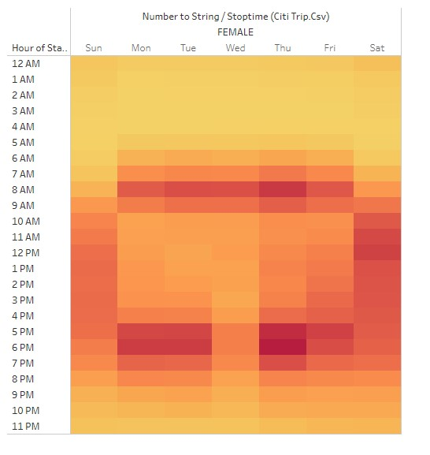
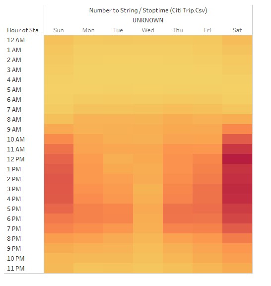
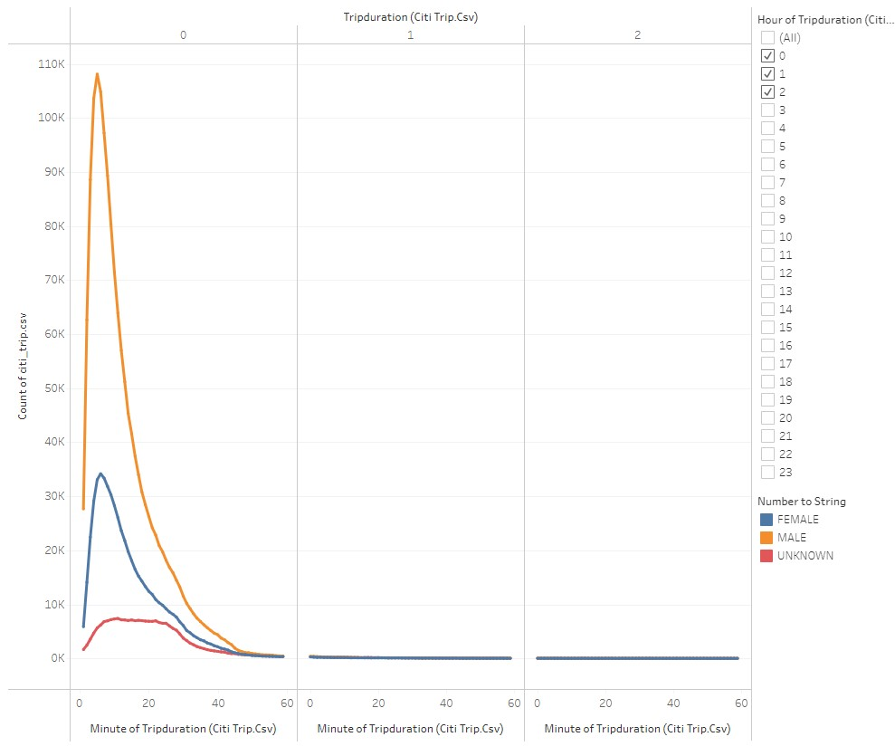

# Overview
Bikesharing project is a challenge to explore data visualizations of Citibike(bike sharing business in New York City) through Tableau. The idea is to explore the data and understand the details of such business so as to make a projection of a similar business in Des Moines, Iowa.

# Results
In order to make our research, we selected the month of August (2019). Being in Summer, August is normally busy and people tend to engage more in outdoor activities giving us the opportunity to analyse more data. In all, there were 2,344,224 in August 2019, being 81% of these rides taken by Subscribers of the service.

In a nutshell, it is easily observed that the busiest hours are the early hours in the morning and in the evening:

The following chart shows each of the bike of the system with its corresponding month riding hours (the larger the dot, the more it rode). This is important to think of maintenance program - the last we want is the bike to break while rented!

The three charts below show the trips by the hour by gender (Male, Female or Unknown when the gender information is not available)

xxxx

[https://public.tableau.com/app/profile/ana.l.gajardoni/viz/Book1_16459145436010/CitibikingProject-Letsbegreen](tableau link)

# Summary
As as extra chart, I would propose making charts correlating Start Location and End Location per hour of the day to see the "flow" of bikes within the stations. Lastly (and very boldly), it would be especially interesting to see  I would like to see an such flow in a chart dynamically 
Tableu challenge
